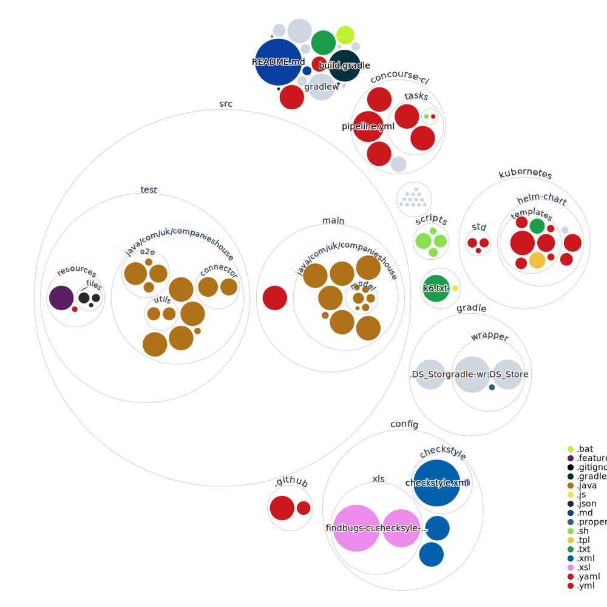
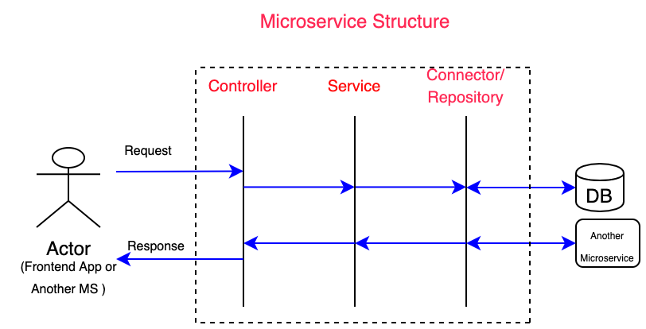
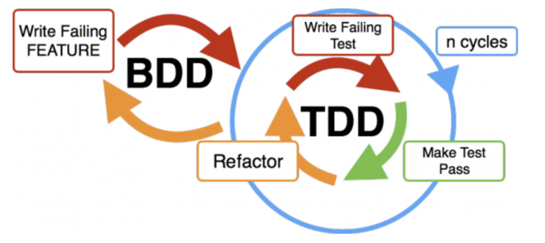
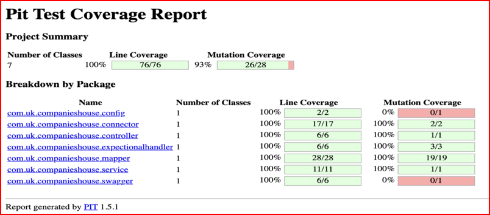
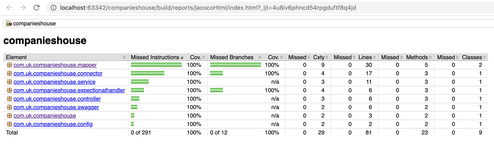
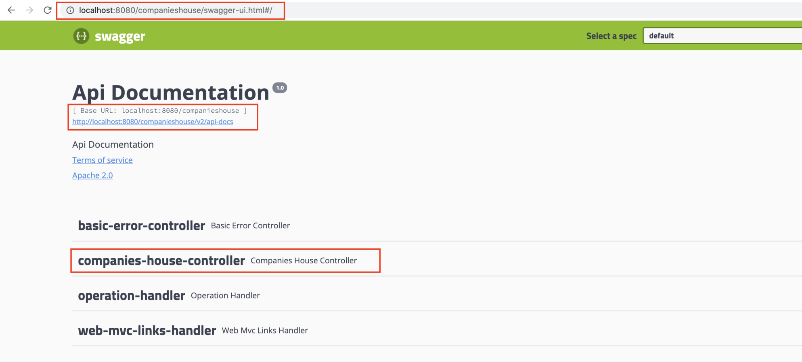
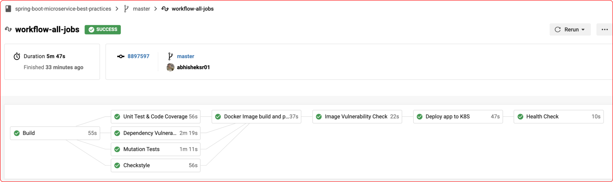

# Spring Boot Micro Service Best Practices & Integrations

### Table of Content

---

- [Introduction](#introduction)
- [Prerequisites](#prerequisites)
- [Installation and Getting Started](#installation-and-Getting-Started)
- [Microservice Structure](#microservice-structure)
- [Development Practice](#development-practice)
- [Integrations](#integrations)
  - [1. Testing](#1-testing)
    - [1.1 Unit Test](#11-unit-test)
    - [1.2 Cucumber End to End Test](#12-cucumber-end-to-end-test)
    - [1.3 Mutation Testing](#13-mutation-testing)
  - [2. Development Accelerators](#2-development-accelerators)
    - [2.1 Mapstruct](#21-mapstruct)
    - [2.2 Lombok](#22-lombok)
    - [2.3 WireMock](#23-wiremock)
  - [3. Analysis and Quality Checks](#3-analysis-and-quality-checks)
    - [3.1 Checkstyle](#31-checkstyle)
    - [3.2 Jacoco](#32-jacoco)
    - [3.3 Hadolint](#33-hadolint)
  - [4. API Documentation](#4-api-documentation)
  - [5. DevSecOps](#5-devsecops)
    - [5.1 Dependency Vulnerability Check](#51-dependency-vulnerability-check)
    - [5.2 Docker Image Vulnerability Check](#52-docker-image-vulnerability-check)
    - [5.3 Infrastructure as code static analysis](#53-infrastructure-as-code-static-analysis)
    - [5.4 Penetration Test](#54-penetration-test)
  - [6. Continuous Integration, Delivery and Deployment](#6-continuous-integration-delivery-and-deployment)
    - [6.1 Docker Containerization](#61-docker-containerization)
    - [6.2 CI and CD Pipeline Tools](#62-ci-and-cd-pipeline-tools)
      - [CircleCI](#circleci)
      - [Concourse](#concourse)
      - [Jenkins](#jenkins)
      - [Google Cloud Build](#google-cloud-build)
  - [7. Platforms](#7-platforms)
    - [7.1 Kubernetes](#71-kubernetes)
    - [7.2 Google Cloud Run](#72-google-cloud-run)
- [What to expect Next!](#what-to-expect-next)
- [Versioning](#versioning)
- [Author](#author)
- [Contributors](#contributors)
- [License](#license)
- [Acknowledgments](#acknowledgments)

---

### Introduction

This project is intended to bring arguably best practices and integrations available for Spring Boot based Microservice
in a single repository.

Developers can use this repository as a template to build there own Microservice by adding or removing dependencies as
per requirement.

In the below section I will try to explain each integration we have made and how to use.

At the moment the Microservice exposes a GET API and expects the company reference as path parameter then makes a call
to the Companies House API hence returning Company Details.

**Note: Texts highlighted in light blue colour are clickable hyperlinks for additional references.**

### Prerequisites

- You must have >= Java 21 Installed. You can use [SDKMAN](https://sdkman.io/install) for maintaining different JDK's in your system.
- If you wish to run the application against the actual Companies House
  API and then you will need to [create a free account](https://developer.companieshouse.gov.uk/developer/signin).
  Once created replace the `authUserName` in the [application.yaml](src/main/resources/application.yaml) under main dir.

### Installation and Getting Started

Let us get started by Cloning or Downloading repository in your local
workstation.

Once cloned/downloaded import the project in your favourite IDE (IntelliJ, Eclipse etc).

We are using [Gradle Wrapper](https://docs.gradle.org/current/userguide/gradle_wrapper.html) for dependency management
so that you do not need to explicitly configure Gradle or Maven.

Execute below gradlew command to download all the dependencies specified in the gradle.build.

```bash
./gradlew clean build
```

As the codebase grows it becomes difficult to visualize the content in it.

Visualization gives enough of a “fingerprint” that viewers can glance at it and see the structure of the codebase.

Thanks to [repo-visualization](https://octo.github.com/projects/repo-visualization) for giving us enough of a “fingerprint” to glance and see the structure of the codebase as below:



<a propertyName = "MSStructure"></a>

### Microservice Structure

We are following Classic Microservice "Separation of Concerns" pattern having Controller <--> Service <--> Connector layers.

The three different takes the responsibilities as below:

- Controller: Controller layer allows access and handles requests coming from the client.<br/>
  Then invoke a business class to process business-related tasks and then finally respond.<br/>
  Additionally Controller may take responsibility of validating the incoming request Payload thus ensuring that any invalid or malicious data do not pass this layer.

- Service: The business logic is implemented within this layer, thus keeping the logic separate and secure from the controller layer.
  This layer may further call a Connector or Repository/DAO layer to get the Data to process and act accordingly.

- Connector/Repository: The only responsibility of this layer is to fetch data which is required by the Service layer to perform the business logic to serve the request.<br/>
  When our Microservice makes a call to another Service we would like to name it as Connector (as in our case) layer whereas when interacting with a DB commonly it's known as Repository.

  

### Development Practice

At the core of the Cloud Native Practices in Software Engineering lies the Behavior Driven Development(BDD) and
Test-Driven Development (TDD).<br/>
While developing the code I followed BDD first approach where I wrote a failing feature/acceptance criteria thus
driving our development through behavior and then followed by Test Driven Development.<br/>
A feature is not considered as developed until all the Unit Tests (TDD) and feature (BDD) passes.



## Integrations

### 1. Testing

#### 1.1 Unit Test

We are using JUnit 5 for running our unit test cases.

```bash
./gradlew test
```

Once executed a report as below will be generated at local path

```bash
build/reports/tests/test/index.html
```


#### 1.2 Cucumber End to End Test

We are using one of the most famous BDD implementation i.e., Cucumber.

Open Class `CucumberTest` in package `com.uk.companieshouse.e2e` and execute CucumberTest from the class.

Once the test execution completes you can see the Cucumber Test Report at :

```bash
../build/reports/cucumber/index.html
```

#### 1.3 Mutation Testing

Pitest is used for performing mutation testing.
To execute the mutation test run :

```bash
./gradlew pitest
```

once the test execution completes report should be accessible at:

```bash
../build/reports/pitest/[TIMESTAMP]/index.html
```



### 2. Development Accelerators

#### [2.1 Mapstruct](https://mapstruct.org/)

An excellent\* library for converting VO to DAO objects and vice versa.

#### [2.2 Lombok](https://projectlombok.org/)

Provides excellent annotations based support for Auto generation of methods, logging, Builders, Validation etc.
We will be using below annotations during this exercise:<br/>
@Data: Auto generates setters, getters, hashcode and toString methods<br/>
@Slf4j: Just add this annotation on top of any Spring Bean and start using the log

#### [2.3 WireMock](http://wiremock.org/)

**Updating instructions WIP**

Click [here](src/test/java/com/uk/companieshouse/e2e/WireMockService.java) to see implementation.

### 3. Analysis and Quality Checks

#### 3.1 Checkstyle

Checkstyle is a static code analysis tool used in software development for checking if Java source code complies with coding rules.

Below config snippet is configured in the [build.gradle](./build.gradle) to include checkstyling.

```bash
plugins {
    id 'checkstyle'
}
checkstyle {
    toolVersion '7.8.1'
}
tasks.withType(Checkstyle) {
    reports {
        xml.enabled false
        html.enabled true
        html.stylesheet resources.text.fromFile('config/xls/checksyle-style.xsl')
    }
}
```

and checkstyle [config at this location](config/checkstyle).

Execute below command to perform static code analysis.

```bash
./gradlew check
```

Once successfully executed Checkstyle reports will be generated at:

```bash
build/reports/checkstyle/main.html
build/reports/checkstyle/test.html
```


#### [3.2 Jacoco](https://www.jacoco.org/jacoco/trunk/index.html)

Code coverage is a preliminary step to know whether our test covers all the scenarios we have developed so far.

Jacoco is a free Java code coverage library distributed under the Eclipse Public License.

Add below configuration in [build.gradle](./build.gradle) to enable Jacoco in your project.

```bash
plugins{
  id 'jacoco'
}
ext{
  jacocoVersion = "0.8.5"
}
// Jacoco for Code Coverage
jacoco {
    toolVersion = "${jacocoVersion}"
    reportsDir = file("$buildDir/customJacocoReportDir")
}

// Runs Jacoco tasks when build task is executed
build {
    finalizedBy jacocoTestReport
    finalizedBy jacocoTestCoverageVerification
}
// Setting custom parameters when executing jacocoTestReport task
jacocoTestReport {
    reports {
        xml.enabled false
        csv.enabled false
        html.destination file("${buildDir}/reports/jacocoHtml")
    }
}

// Setting custom parameters when executing jacocoTestCoverageVerification task for setting rules
jacocoTestCoverageVerification {
    violationRules {
        rule {
            limit {
                minimum = 1.0
            }
        }

        rule {
            enabled = false
            element = 'CLASS'
            includes = ['org.gradle.*']

            limit {
                counter = 'LINE'
                value = 'TOTALCOUNT'
                maximum = 1.0
            }
        }
    }
}
```

Execute below commands to generate and test code coverage(jacoco tasks depends on test task).

```bash
./gradlew test -Pexcludee2e=**/true*
./gradlew jacocoTestReport
./gradlew jacocoTestCoverageVerification
```

Once successfully executed a report as shown below will be generated at path

```bash
build/reports/jacocoHtml/index.html
```



#### [3.3 Hadolint](https://github.com/hadolint/hadolint)

A smarter Dockerfile linter that helps you build best practice Docker images.

Running Locally:

You may wish to install the tooling locally [click here](https://github.com/hadolint/hadolint#install) to see the available options.

Once installed just run below command:
```
hadolint DOCKER_FILE
```

Example: Execute from the root of this repo as we have 2 dockerfiles in this repo.
```bash
hadolint testhadolinttest.Dockerfile
```

or you may directly run using the docker as below:
```bash
docker run --rm hadolint/hadolint < testhadolinttest.Dockerfile
```

Expected Output:
```agsl
testhadolinttest.Dockerfile:8 DL3018 warning: Pin versions in apk add. Instead of `apk add <package>` use `apk add <package>=<version>`
testhadolinttest.Dockerfile:8 DL3019 info: Use the `--no-cache` switch to avoid the need to use `--update` and remove `/var/cache/apk/*` when done installing packages

```

Fix:  Pin versions in apk add and Use the `--no-cache` as shown below:
```agsl
RUN apk add --no-cache --upgrade libtasn1=4.14-r0 sqlite-libs=3.28.0-r3 musl-utils=1.1.20-r6 libjpeg-turbo=1.5.3-r6 \
libx11=1.6.12-r0 freetype=2.9.1-r3
```

In pipeline:

We can use hadolint to lint dockerfile in the pipeline before building the images, [click here](https://github.com/abhisheksr01/spring-boot-microservice-best-practices/blob/8a78f5c4939f2637832ed0d2f9ee6f70a351577b/.circleci/config.yml#L162) to see how we can configure in CircleCI.

Hadolint allows us to add configuration file to configure rules to ignore errors, trusted registries etc, [click here](https://github.com/hadolint/hadolint#configure) to learn more.

### 4. API Documentation

With the latest version of [SpringDoc-API](https://springdoc.org/v2/) you just need to include a single dependency as below & that's it.
```bash
implementation "org.springdoc:springdoc-openapi-starter-webmvc-ui:2.0.4"
```

This library supports:
- OpenAPI 3
- Spring-boot v3 (Java 21 & Jakarta EE 9)
- JSR-303, specifically for @NotNull, @Min, @Max, and @Size.
- Swagger-ui
- OAuth 2
- GraalVM native images

To test it locally start the application then Swagger UI documentation can be accessed by URL:

```bash
http://localhost:8080/companieshouse/swagger-ui/index.html
```


Once application is deployed in a Platform the same documentation will be accessible by below URL:

```bash
http://[HOST_URL]/companieshouse/swagger-ui/index.html
```

where "companieshouse" is the context path.

### 5. DevSecOps

DevSecOps stands for development, security, and operations. It's an approach to culture, automation, and platform design that integrates security as a shared responsibility throughout the entire application and infrastructure security lifecycle.


In this repo we are looking at some of the key practices to secure the application and infrastructure.

  #### 5.1 Dependency Vulnerability Check

  Introduction:<br/>
  A vulnerability is a hole or a weakness in the application, which can be a design flaw or an implementation bug, that allows an attacker to cause harm to the stakeholders of an application.<br/>
  In this section we are focusing on identifying [vulnerabilities](https://owasp.org/www-community/vulnerabilities/) within dependencies used in the code base.

  We will be using the [**OWASP Dependency-Check**](https://owasp.org/www-project-dependency-check/) for this.

  Configuration:<br/>
  Add below config snippet in your [build.gradle](./build.gradle) to include dependency vulnerability checks.

  ```bash
  plugin {
    # The version may change, please check the build.gradle for the latest version used in t he project
    id "org.owasp.dependencycheck" version "9.0.8"
  }
  dependencyCheck {
      // the default artifact types that will be analyzed.
      analyzedTypes = ['jar']
      // CI-tools usually needs XML-reports or JUnit XML reports, but humans needs HTML.
      formats = ['HTML', 'JUNIT']
      // Specifies if the build should be failed if a CVSS score equal to or above a specified level is identified.
      failBuildOnCVSS = 7
      outputDirectory = "build/reports/dependency-vulnerabilities"
      // specify a list of known issues which contain false-positives
      suppressionFiles = ["$projectDir/config/dependencycheck/dependency-check-suppression.xml"]
  }
  ```

  Execution:<br/>
  Run below gradle task to trigger the vulnerability checks

  ```bash
  ./gradlew dependencyCheckAnalyze
  ```

  Note: First execution may take 10 mins or so (as this task downloads a copy of the vulnerabilities db locally).

  Once successfully executed the task will generate a vulnerability report at path (assuming the above path was used) as below:

  ```bash
  build/reports/dependency-vulnerabilities
  ```

  

  Suppression:<br/>
  If you wish to suppress dependencies from vulnerability analysis (maybe because of breaking changes) declare them in the [dependency-check-suppression.xml](config/dependencycheck/dependency-check-suppression.xml) as below:
  ```bash
  <suppress>
     <notes><![CDATA[file name: checkstyle-7.8.1.jar]]></notes>
     <sha1>7b4a274696a92f3feae14d734b7b8155560a888c</sha1>
     <cve>CVE-2019-10782</cve>
  /suppress>
  ```

  #### 5.2 Docker Image Vulnerability Check

 Docker image security scanning should be a core part of your Docker security strategy. </br>
 Although image scanning won't protect you from all possible security vulnerabilities, it's the primary means of defense against security flaws or insecure code within container images. It's therefore a foundational part of overall Docker security.

To learn how to containerize application [click here.](#61-docker-containerization)

 In this section we'll be using [Trivy](https://github.com/aquasecurity/trivy).

 - Using Local Installation:</br>
   Click [here](https://github.com/aquasecurity/trivy#installation) to follow installation instructions.

   Example:
   ```bash
   macOS:
   brew install aquasecurity/trivy/trivy

   or

   curl -sfL https://raw.githubusercontent.com/aquasecurity/trivy/master/contrib/install.sh | sh -s -- -b /usr/local/bin
   ```

    Execute below command to scan a image:
    ```bash
    trivy [DOCKER_IMAGE:TAG]
    ```
    Example:</br>
    ```bash
    Local Image : trivy test-image:latest
    Remote Image: trivy abhisheksr01/companieshouse:latest
    ```

 - [Using Docker Image Locally:](https://github.com/aquasecurity/trivy#docker)</br>
   This is the most convenient way to use trivy(because you don't mess with local installation)

   Scanning local image in macOS:
   ```bash
   docker run --rm -v /var/run/docker.sock:/var/run/docker.sock \
    -v $HOME/Library/Caches:/root/.cache/ aquasec/trivy LOCAL_DOCKER_IMAGE:TAG
   ```
   Scanning Remote Image (e.g. Docker Hub)
   ```bash
   Syntax : docker run -it aquasec/trivy:latest [DOCKER_HUB_REPO]/[DOCKER_IMAGE_NAME]:[TAG]
   Example: docker run -it aquasec/trivy:latest openjdk:21-slim
   ```
   Once executed successfully it output a tabular report by default(which can be changed).

- [Within CI Pipeline](https://github.com/aquasecurity/trivy#continuous-integration-ci)
  1. CircleCI:</br>
  Search for jobs "check_image_vulnerability" in [config.yml](.circleci/config.yml). This is the example of how you can run job independently (scheduled vulnerability check or from the registry).</br>
  Search for job "image_build_scan_push" in [config.yml](.circleci/config.yml). This is the example of how you can run scan against your local image before even pushing to the registry.
  2. Cloud Build:</br>
  This is very basic usage of trivy & image is pulled from GCP Registry, click [here](./cloudbuild.yaml) to GCP Cloud Build configuration.

  Refer the trivy [github doc](https://github.com/aquasecurity/trivy) for further reference.

#### 5.3 Infrastructure as Code static analysis

Static analysis can be conducted on the IAC, just like it can be done on any other software programming language.

The IAC static analysis can be done on configuration and code such as:

- Dockerfile: It is possible to scan a Dockerfile to determine if the file contains a potential vulnerability, such as the use of root, a vulnerable base docker image, etc.

- Kubernetes Configuration: Helm charts or standard k8s YAML configurations can pose security risks, exposing internal information such as NGINX Ingress through annotations, running containers with allowPrivilegeEscalation etc.

- Terraform: For deploying Cloud Infrastructure, it is the most commonly used form of IAC. As a result, there is an increased risk of introducing vulnerabilities into the cloud infrastructure. Keeping the infrastructure secure is crucial since it sits at the bottom of the application architecture.

#### Key traits of good security tooling chain.

- Easy to integrate with other tooling such as CICD pipeline, Monitoring tool, Repositories etc.
- Developer Adaptability and ease of use: The tool should be easy to use and can educate on CVE's identified.
- Less Noise and efficient mechanism to control it
- Vulnerability Database
- Relevancy to the solution we are developing

One name that stands out in meeting above criteria with almost all the desired feature is [Snyk](https://snyk.io/).

Snyk is Free to use and can be signed up using Github with below limitations for personal usage:

```
200 Open Source tests/month
100 Container tests/month
300 IaC tests/month
100 Code tests/month
```

Snyk has some really great features, such as:

- Native Github Integration allowing importing selective repositories or in bulk.
- Great User Interface for analyzing the scan outcome.
- Automated vulnerabilities fixes for dependencies, docker image etc through PR's.
- IDE Plugins
- Scheduled scans once a repository has been imported
- Ignoring a vulnerability for a definite time
- Snyk CLI

and the list can keep on going.

#### 5.4 Penetration Test
A penetration test, colloquially known as a pen test, pentest or ethical hacking, is an authorized simulated cyberattack on a computer system, performed to evaluate the security of the system. Not to be confused with a vulnerability assessment.

In this section we are going to explore [OWASP ZAP](https://www.zaproxy.org/docs/docker/) & will be penetrating through REST API's.

* [PenTest using Docker Image Locally](https://www.zaproxy.org/docs/docker/about/)

  We will be using the **owasp/zap2docker-weekly** to run the [ZAP Baseline Scan](https://www.zaproxy.org/  docs/docker/baseline-scan/).<br/>
  Execute below command to test your API
  ```bash
  docker run -v $(pwd):/zap/wrk/:rw -t owasp/zap2docker-weekly zap-baseline.py \
      -t [TARGET_REST_API] -g gen.conf -r pentest-report.html
  ```

  | Parameter       |      Description                         |
  |-----------------|:---------------------------------------- |
  | $(pwd)          | Directory where report will be generated |
  | zap-baseline.py | Zap's python script                      |
  | -t [TARGET_URL] | URL to be Pen Tested                     |
  | -g gen.conf     | zap-baseline rule configuration file     |
  | -r report.html  | Name of HTML report                      |

  The **gen.conf** can be changed between WARN to IGNORE (ignore rule) or FAIL (failing) if rule matches in the PenTest.

* Within Pipeline:

  So We have got PenTest Running after the application deployed successfully.
  Open [config.yml](.circleci/config.yml) & search for **penetration_test** to see the implementation.</br>
  Alternatively you can check the latest Pen Test Execution in CircleCI by clicking [here](https://app.circleci.com/pipelines/github/abhisheksr01/spring-boot-microservice-best-practices/117/workflows/1ad0442f-791c-47d1-8da9-f44f656872f5/jobs/567).

  Once we run the PenTest & issues are identified we need to fix them, right?</br>
  But how !!!!!!!!!!</br>
  For that you should review the PenTest report closely & understand why the particular issue was raised.</br>

  Let us review alerts which were identified in this app & how I fixed them.</br>
  Click [here](https://505-229818740-gh.circle-artifacts.com/0/penetration-test-report.html) to open the Zap HTML report.</br>
  The report has **3 Low** alerts & were raised because of response headers appended by the Kubernetes Platform where the app is deployed.</br>
  To fix the issue I had to apply appropriate header values in the [Ingress.yaml](kubernetes/std/ingress.yaml)(Kubernetes specific config file) & once fixed app deployed [PenTest Report](https://567-229818740-gh.circle-artifacts.com/0/penetration-test-report.html) didn't raise those alert.

  We can also perform Penetration Test for bunch of URLs. Click [here](https://github.com/zaproxy/community-scripts/tree/master/api/mass-baseline) to see the Mass Baseline.


### 6. Continuous Integration, Delivery and Deployment

**Continuous Integration**: It's a software development practise where members of a team integrate their work frequently, usually each person integrates at least daily - leading to multiple integrations per day.<br/>
Each integration is verified by an automated build (including test) to detect integration errors as quickly as possible.

Continuous Integration is a key step to digital transformation.

**Continuous Delivery**: It's software engineering approach in which teams produce software in short cycles, ensuring that the software can be reliably released at any time and, when releasing the software, doing so **manually**.

**Continuous Deployment**: It means that every change goes through the pipeline and **automatically** gets put into production, resulting in many production deployments every day.<br/>
To do Continuous Deployment you must be doing Continuous Delivery.

Pictorial representation of the above two approaches:


Reference :

- https://martinfowler.com/articles/continuousIntegration.html
- https://martinfowler.com/bliki/ContinuousDelivery.html
- https://dzone.com/articles/continuous-delivery-vs-continuous-deployment-an-ov

Now let us look at the key building blocks for achieving CI/CD.

#### 6.1 Docker Containerization

Containerization is the process of distributing and deploying applications by packaging the application components & its dependencies into a standardized, isolated, lightweight process environments called containers.

Docker is the widely adapted Containerization platform developed to simplify and standardize deployment in various such environments using a specially packaged files known as **[Docker Images](https://docs.docker.com/engine/reference/builder/)**.

Before we continue further make sure you have docker installed, if not [click here](https://docs.docker.com/engine/install/) to see the instructions.

Docker uses a text file with set of instructions in it to build a docker image. Below given is a list of some of the most common Docker keywords used:

  | KEYWORD       | Usage Description                                                                                                                    |
  |:--------------|:-------------------------------------------------------------------------------------------------------------------------------------|
  | FROM          | Defines the base image to use to start the build process. A image defined here will be pulled from Docker Hub or other container repository. It needs to be the first command declared inside a Dockerfile.                                                                             |
  | WORKDIR       | Set where the command defined with CMD is to be executed.                                                                            |
  | ENV           | Sets an Environment variable within the container & can be accessed by scripts and applications alike.                               |
  | CMD           | Execute the given command when a container is instantiated using the image being built.                                              |
  | RUN           | Execute any additional command when docker image is built.                                                                           |
  | EXPOSE        | Used to associate a specified port to enable networking between the running process inside the container and the outside world (i.e. the host).                                                                                                                                             |
  | COPY          | Takes in a src and destination arguments & copy a local file or directory from your host (the machine building the Docker image) into the Docker image itself.                                                                                                                               |
  | ADD           | Apart from what COPY does, it also supports 2 other sources. First, you can use a URL instead of a local file / directory. Secondly, you can extract a tar file from the source directly into the destination.                                                                              |
  | ENTRYPOINT    | Sets the concrete default application that is used every time a container is created using the image. For example, here we are using Spring Boot application inside the image. To only run that application use ENTRYPOINT and whenever a container is created our application will be the target. If we couple ENTRYPOINT with CMD, we can remove “application” from CMD and just leave “arguments” which will be passed to the ENTRYPOINT.                                                                                                                                            |

Now let us have a quick look at our [ci.Dockerfile](./ci.Dockerfile) given below:

  ```bash
  FROM openjdk:21-slim

  WORKDIR /opt

  EXPOSE 8080

  RUN apk update

  ARG APPJAR=build/libs/companieshouse-0.0.1-SNAPSHOT.jar

  COPY ${APPJAR} companieshouse-0.0.1-SNAPSHOT.jar

  ENTRYPOINT exec java $JAVA_OPTS -jar companieshouse-0.0.1-SNAPSHOT.jar
  ```

  - First instruction FROM is used for pulling openjdk:21-slim from Docker Hub
  - WORKDIR sets the opt as working directory
  - RUN As this is an Alpine image we are using apk to update the image dependencies
  - ARG set an argument to be used later in the file
  - COPY copies the jar from the host machine inside the docker image
  - ENTRYPOINT sets the spring boot application as default & starts the application when container is instantiated

Here we are using two flavours of Dockerfile.
Although in a real world scenario you will typically have only 1 Dockerfile but here for learning perspective I have got 2.

6.1.1 [Dockerfile](./Dockerfile):

It uses an intermediate **gradle:8.5-jdk21** container for building an executable jar and then **openjdk:21-slim** as a base image  by copying the jar for application docker image.</br>
This Dockerfile will be handy and is an example of using intermediate containers when we do not have respective runtime (JAVA) & package manager (gradle) installed locally for building the executable application.

- Execute below command to build a docker image, if no docker file is specified in CLI it defaults to **Dockerfile**.
  ```bash
  docker build -t companieshouse:latest .
  ```
  where **companieshouse:latest** follows the syntax of **[IMAGE_NAME]:[TAG]**

- To check the latest docker image being created execute below command:
  ```bash
  docker images
  ```
  Output:

  

- To start the container using the newly created docker image
  ```bash
  docker run --rm -it -p 8080:8080 companieshouse:latest
  ```
  Here, --rm is used for removing the container once stopped, --it to start the application in interactive mode & -p for port forward.

  Once the container is being created & application started you should see an message in the terminal as below:
  ```
  2020-08-11 13:44:09.679  INFO 1 --- [main] c.u.c.CompaniesHouseApplication : Started CompaniesHouseApplication in 6.565 seconds (JVM running for 7.529)
  ```
  To verify the application has successfully started open the swagger page using below URL in your browser of choice.

  http://localhost:8080/companieshouse/swagger-ui/index.html

  Open a new terminal to see the newly created container by executing below command:

  ```bash
  docker container ls
  ```

  alternatively:
  ```bash
  docker ps -a
  ```

  Output:
  

  Take note of the CONTAINER ID.

- Validating the container has been removed once application stopped.

  Stop the container using the **Control + C** key alternatively in the new terminal execute below command to kill the container.

  ```bash
  docker container kill [CONTAINER_ID]
  ```

  Execute below command to check whether the container has been removed or not.

  ```bash
  docker container ls
  ```

  Now try removing the **--rm** flag from the docker run command to instantiate the container then stop & check whether container has been removed or not by running container list command.

6.1.2 [ci.Dockerfile](./ci.Dockerfile):
Typically in a Pipeline we would build a executable jar as part of initial task and store it as a artifact. Once the code meets all the quality requirements instead of rebuilding the jar this Dockerfile will copy the existing one from the specified path while creating the image.

You must have Java installed in your workstation if not [click here to download](https://www.oracle.com/technetwork/java/javaee/documentation/ee8-install-guide-3894351.html).

- Create a executable jar by running below command

  ```bash
  ./gradlew clean build
  ```

- Create a docker image using the ci.Dockerfile by executing below command

  ```bash
  docker build -f ci.Dockerfile -t companieshouse:0.0.1 .
  ```

  Here using the -f flag we can pass a non default dockerfile. Follow the same instruction as given Section 1 to test the application.

6.1.3 Pushing & Pulling image from Docker Hub

Now let us focus on distribution aspect of docker, So far we have learnt how to create docker image & its basic lifecycle but how we can share it with other developers or use in the application deployment.

For this purpose we will be using Docker Hub which is the free Docker Registry for storing the docker images.

[Click here](https://hub.docker.com/) to create a free docker hub account.

Configure docker cli to use these new credentials:

```bash
docker login -u [DOCKER_HUB_USERNAME] -p [DOCKER_HUB_PASSWORD]
```

Build your image by executing below command:

```bash
docker build -t [DOCKER_HUB_USERNAME]/companyhouse:0.0.1 .
```

Then push the image to the remote registry.

```bash
docker push [DOCKER_HUB_USERNAME]/companyhouse:0.0.1
```

Open Docker hub & validate whether the docker image has been pushed successfully.

Now let us delete the local docker image.

```bash
docker rmi companieshouse:0.0.1 -f
```

Validate the same by running:
```bash
docker images
```

Now let us pull the remote docker image:
```bash
docker pull [DOCKER_HUB_USERNAME]/companyhouse:0.0.1
```

or you can pull any other public image as pull doesn't require credentials for public images.

Further Reading:
- https://www.digitalocean.com/community/tutorials/the-docker-ecosystem-an-introduction-to-common-components
- https://docs.docker.com/engine/reference/builder/
- https://docs.docker.com/develop/develop-images/dockerfile_best-practices/

#### 6.2 CI and CD Pipeline Tools

- #### [CircleCI](https://circleci.com/)

  CircleCI is a Software as a Service (SaaS) CI/CD pipeline tool chain in the DevOps world. Personally I found it quite easy to integrate with the GitHub repo and start building my CI/CD pipeline.<br/>
  CircleCI runs each job in a separate container or VM. That is, each time your job runs CircleCI spins up a container or VM to run the job in.

  At the time of writing this article CircleCI's free-tier provides 2500 free credits to run GitHub & Bit Bucket repositories based pipelines.

  It is highly recommended to go through [CircleCI's official Getting Started](https://circleci.com/docs/2.0/getting-started/#section=getting-started).

  To start using CircleCI follow below steps:

  1. [Sign UP](https://circleci.com/docs/2.0/first-steps/)
  2. Create a folder **.circle** and a pipeline config file inside it as **config.yml** (beware the extension should strictly be .yml rather than .yaml, i hope CircleCI fixes this in upcoming releases).
  3. CircleCI's basic building blocks are:

  - [Jobs](https://circleci.com/docs/2.0/jobs-steps/#jobs-overview): Where individual stages in our pipeline is executed.
  - [Steps](https://circleci.com/docs/2.0/jobs-steps/#steps-overview): A collection of executable commands which are run during a job.
  - [Workflows](https://circleci.com/blog/modernizing-federal-devops-circleci-becomes-first-continuous-integration-tool-with-fedramp-authorization/): It orchestrate the jobs as a pipeline.
  - [Executors](): Underlying technology or environment in which to run a job. Example: Docker images, Linux virtual machine (VM) image, MacOS VM image, Windows VM image
  - [Orbs](https://circleci.com/docs/2.0/jobs-steps/#orbs-overview): Reusable & Shareable packages of configs which can be imported to ease the pipeline configurable.

  4. Click [here](.circleci/config.yml) to open the CircleCI config file for this project. When this config runs for the "workflow-all-jobs" the output pipeline is shown below and deploys the app to AWS EKS Cluster.
     
  5. If you wish to use this config file in your project you must create a context "credentials" and add below Environment Variables with respective values.

     Follow [link](https://circleci.com/docs/2.0/env-vars/?utm_medium=SEM&utm_source=gnb&utm_campaign=SEM-gb-DSA-Eng-ni&utm_content=&utm_term=dynamicSearch-&gclid=EAIaIQobChMIm_2blLze6QIVQeztCh3FGwh0EAAYASAAEgITlPD_BwE#setting-an-environment-variable-in-a-context) to learn how to do it.

     ```bash
     AWS_ACCESS_KEY_ID
     AWS_DEFAULT_REGION
     AWS_SECRET_ACCESS_KEY
     DOCKER_USER (Your docker username)
     DOCKER_PASS (Your docker user's password)
     EKS_CLUSTER_NAME (Kubernetes cluster    name)
     DOCKER_IMAGE (Docker Image name)
     EKS_NAMESPACE (Kubernetes namespace to which the aws user has access to and you would like to deploy)
     HEALTH_ENDPOINT (Health Endpoint of your app)
     ```

  6. [Scheduled Workflows](https://circleci.com/docs/2.0/workflows/?utm_medium=SEM&utm_source=gnb&utm_campaign=SEM-gb-DSA-Eng-ni&utm_content=&utm_term=dynamicSearch-&gclid=EAIaIQobChMI4fi6icfe6QIVBbTtCh3YRwFcEAAYASAAEgJKhPD_BwE#scheduling-a-workflow):
     CircleCI supports scheduled execution of the workflow, look for **scheduled-vulnerability-check** in the [config.yml](.circleci/config.yml).<br/>
     Here I am checking for vulnerabilities within my code libs and docker images at scheduled intervals.
     <br/>What I like about this feature is we do not need to create a separate pipeline file or steps to run the jobs.

- #### [Concourse](https://concourse-ci.org/)

  [Concourse](https://concourse-ci.org/) is an open-source continuous thing-doer.

  Built on the simple mechanics of resources, tasks, and jobs, Concourse presents a general approach to automation that makes it great for CI/CD.

  Let us quickly spin a concourse pipeline locally and before proceeding make sure you have Docker installed.

  From the root of the project change the directory:
  ```bash
  cd concourse-ci
  ```

  Execute below command to spin a local concourse tool:
  ```bash
  make spin-concourse

  or 

  cd local-concourse; \
  docker compose up -d
  ```

  Access the local concourse using the URL http://127.0.0.1:8080/ and then download FLY CLI utility from the concourse home page.

  Update the credentials in the [secrets/vars.yml](./concourse-ci/secrets/vars.yml)

  Now execute below command to configure the pipeline job.
  ```bash
  make set-pipeline

  or
  
  fly -t main set-pipeline -p spring-boot-best-practices -c pipeline.yml -l ./secrets/vars.yml
  ```

  Authenticate the pipeline by clicking link highlighted in CLI with USERNAME/PASSWORD as admin/admin.

  Then approve the pipeline configuration by typing "y" and hit enter.

  By default all the pipelines in concourse are paused, execute below command to un pause the same.

  ```bash
  fly -t main unpause-pipeline -p spring-boot-best-practices
  ```

  The pipeline can be accessed using the URL http://127.0.0.1:8080/teams/main/pipelines/spring-boot-best-practices

- #### [Jenkins](https://jenkins.io/)
  
  Jenkins is one of the most widely used CI/CD Build Tool preferred by many Organizations especially within Enterprises.

  Installation Guide:

  1. Jenkins Image (**Recommended**): If you have docker installed, the easiest way to get started is with Jenkins public image.
     
      Execute below command to start jenkins at http://localhost:9090
      ```bash
      docker run -e JENKINS_OPTS="--httpPort=9090" -d -v jenkins_home:/var/jenkins_home -p 9090:9090 -p 50000:50000 jenkins/jenkins:lts
      ```

      Get the jenkins container name: 
      ```bash
      docker ps
      ```

      After replacing the jenkins container name execute below command to get the default admin password:
      ```bash
      docker exec -it ${JENKINS_CONTAINER_NAME} cat /var/jenkins_home/secrets/initialAdminPassword
      ```
      Note: 
  
      Jenkins by default starts at port 8080 & our spring boot application also uses the same port.</br>
      Hence to avoid the Binding Exception we are using an environment variable **-e JENKINS_OPTS="--httpPort=9090"**.

      Access local Jenkins at http://localhost:9090/ and install all the recommended plugins.

      Additonal Plugins:
      * HTML Publisher

      To learn more about this approach [click here.](https://github.com/jenkinsci/docker/blob/master/README.md)

  2. Jenkins War: Follow the [instructions](https://www.blazemeter.com/blog/how-to-install-jenkins-on-the-apache-tomcat-server/)
     to install the Jenkins and run on a Web Server.

     **Updating instructions WIP**

     Click [here](jenkins/jenkinsfile) to see implementation.

- #### [Google Cloud Build](https://cloud.google.com/cloud-build/docs/)

  Cloud Build is a service that executes your builds on Google Cloud Platform infrastructure.<br/>
  Cloud Build can import source code from Google Cloud Storage, Cloud Source Repositories, GitHub, or Bitbucket,
  execute a build to your specifications, and produce artifacts such as Docker containers or Java archives.

  Cloud Build executes your build as a series of build steps, where each build step is run in a Docker container.

  We can either trigger Cloud Build through `gcloud` CLI or by declaring the steps in `cloudbuild.yaml`.

  **Updating instructions WIP**

  Click [here](./cloudbuild.yaml) to see implementation.

  #### Exercise:

  To perform this exercise you must have signed for [Google Cloud Platform account](https://cloud.google.com)
  and [gcloud SDK configured](https://cloud.google.com/sdk/docs/quickstarts).

  You can register [here](https://cloud.google.com/free) for GCP Free Tier.

  We are going to deploy our Microservice container to Cloud Run (Fully Managed through Cloud Build).

  Execute below command to use local `cloudbuild.yaml` to perform steps

  - Create a docker image & store it in Container Registry
  - Deploy the image to Cloud Run (Fully Managed)

  ```bash
  gcloud builds submit
  ```

### 7. Platforms

#### 7.1 Kubernetes

**Updating instructions WIP**

- Standard App Deployment

  Source files at :

  ```bash
  kubernetes/std/
  ```

  ```bash
   kubectl apply -f kubernetes/std/ -n [NAMESPACE]
  ```

- Helm Chart

  Source files at :

  ```bash
  kubernetes/helm-chart/
  ```

  ```bash
   kubectl apply -f kubernetes/helm-chart/ -n [NAMESPACE]
  ```

#### [7.2 Google Cloud Run](https://cloud.google.com/run/)

Cloud Run is a fully managed to compute platform that automatically scales your stateless containers.<br/>
Cloud Run is Serverless: it abstracts away all infrastructure management, so you can focus on what matters most - building great applications.<br/>
Cloud Run is available in below two flavours:

- Cloud Run Fully Managed
- Cloud Run on Anthos, which supports both Google Cloud and on‐premises environments.

### Built With

- [Spring Boot](https://spring.io/projects/spring-boot) - The REST framework
  used
- [GRADLE](https://gradle.org/) - Dependency Management

### What to Expect Next!

As the world of software engineering is evolving so we do.<br/>
Listing down some of the exciting features am going to work on and update the GitHub in coming days, they are:

- GitHub Actions
- Chaos Monkey
- Hystrix
- CORS (Cross-Origin)

### Versioning

We use [SemVer](http://semver.org/) for versioning. For the versions
available, see the
[tags on this repository](https://github.com/your/project/tags).

### Author

- **Abhishek Singh Rajput** - _Initial work_ -
  [abhisheksr01](https://github.com/abhisheksr01)

### Contributors

As mentioned in the [Introduction](#introduction) through this project we would like to bring the Best Practices and Integration under one umbrella.

So you are most welcome to improve or add new features you could think of.

### License

This project is licensed under the MIT License - see the
[LICENSE.md](LICENSE.md) file for details

### Acknowledgments

- [Eugen Paraschiv](https://www.baeldung.com/) : For wonderful tutorials
